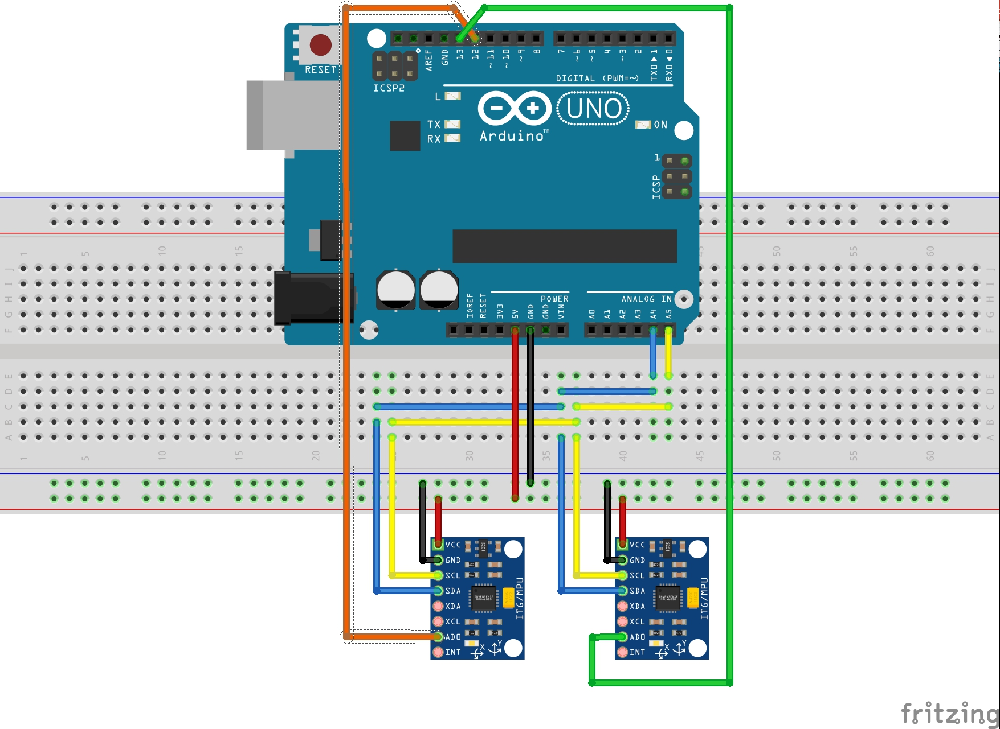

# Getting raw data from multiple MPU-6050s interfaced with Arduino
Taking the steps below, you can get raw values from your MPU-6050 modules. These raw value include:

- Accelerometer output towards x, y and z axes
- Gyroscope output towards x, y and z axes

## Step 1
Wire your MPU-6050 modules to an Arduino as shown in the wiring diagram as below.
<br><br><br>


## Step 2
Run the sketch.

__Note.__ I've used `Clion` + `PlatformIO` as IDE. But using the official Arduino IDE would be ok as well. Just be 
sure to install [this](https://github.com/jrowberg/i2cdevlib/tree/master/Arduino/I2Cdev) and [this](https://github.com/jrowberg/i2cdevlib/tree/master/Arduino/MPU6050) 
library before compiling and uploading the sketch to the Arduino.

## Step 3
After uploading the sketch, You should see output like this:
```
20:18:00.033 -> 1	1	4110	-3	-1	-2	-2	-2	4093	-1	-1	0	
20:18:00.066 -> 1	-4	4105	-3	-1	-2	-1	2	4096	-2	-1	0	
20:18:00.099 -> 1	-3	4107	-2	-1	-2	-4	1	4097	-2	-1	0	
20:18:00.166 -> 0	-4	4110	-3	-1	-2	-1	-1	4093	-2	-1	-1	
20:18:00.199 -> -3	1	4107	-2	-1	-2	1	-5	4092	-2	-1	0	
20:18:00.232 -> -1	-1	4108	-2	-2	-1	-1	-3	4098	-2	-1	0	
20:18:00.299 -> -1	4	4107	-2	-2	-1	-2	0	4095	-2	-1	0	
20:18:00.332 -> -2	-2	4111	-2	-2	-2	2	0	4098	-2	-1	-1	
20:18:00.365 -> -4	0	4112	-1	-2	-2	2	1	4099	-2	0	-1	
20:18:00.431 -> -3	0	4108	-1	-2	-3	1	1	4098	-2	0	-1	
20:18:00.464 -> -1	-2	4108	-2	-1	-2	-5	-5	4097	-2	-1	-1	
20:18:00.498 -> -3	-2	4107	-2	-1	-2	-3	-5	4101	-1	0	-1	
20:18:00.564 -> -2	0	4115	-2	-1	-2	-3	-3	4094	-1	-1	-1	
20:18:00.597 -> 0	-3	4107	-3	-1	-1	-1	-1	4105	-1	-1	0	
20:18:00.630 -> -2	0	4112	-3	-1	-2	0	0	4099	-2	-1	-1	
20:18:00.697 -> -3	2	4118	-2	0	-2	2	-1	4093	-2	0	0	
20:18:00.730 -> -1	2	4113	-2	-1	-2	-1	1	4093	-2	-1	-1	
20:18:00.763 -> -2	0	4113	-2	-1	-2	0	-1	4095	-2	-1	0	
20:18:00.829 -> -1	-1	4111	-3	-1	-1	-1	-2	4095	-2	0	0	
20:18:00.863 -> 0	-3	4109	-2	-1	-2	0	-2	4100	-2	0	-1	
20:18:00.929 -> 0	-3	4111	-2	-2	-2	2	-3	4098	-2	0	0	
20:18:00.962 -> -4	0	4112	-2	-1	-1	1	0	4102	-2	-2	0	
20:18:00.995 -> 2	-3	4111	-2	-2	-1	-2	-3	4095	-2	-1	-1
20:18:01.062 -> 0	-6	4113	-2	-2	-2	-1	-4	4094	-2	-1	-1	
20:18:01.095 -> -2	-6	4116	-3	-1	-2	0	-1	4097	-1	-1	-1	
20:18:01.128 -> -3	-4	4112	-3	-1	-2	-5	-2	4094	-1	-1	0	
20:18:01.194 -> -1	-3	4114	-2	-1	-1	1	-2	4097	-1	-1	0	
20:18:01.228 -> -2	-1	4110	-2	-2	-2	-2	-1	4099	-2	-2	0	
20:18:01.261 -> 0	-2	4109	-2	-2	-1	-5	1	4098	-2	-2	-1	
20:18:01.327 -> -1	1	4110	-2	-2	-2	-2	1	4097	-1	-2	0	
20:18:01.360 -> -2	1	4114	-2	-2	-2	-3	-5	4097	-1	-1	0	
20:18:01.394 -> 0	-1	4104	-2	-2	-2	2	-7	4098	-2	-1	-1	
20:18:01.460 -> -1	-4	4100	-2	-1	-2	-6	-1	4093	-2	-1	-1	
20:18:01.493 -> -3	-3	4105	-2	-1	-2	0	-1	4094	-2	0	-1	
20:18:01.526 -> 1	-4	4109	-2	-1	-2	-3	-4	4097	-2	0	-1	
20:18:01.593 -> 0	-1	4112	-1	-2	-2	-3	0	4091	-1	0	0	
20:18:01.626 -> 1	-1	4107	-2	-2	-1	0	-3	4095	-1	-1	-1	
20:18:01.692 -> 0	-4	4111	-2	-1	-2	0	-4	4097	-1	0	-1	
20:18:01.725 -> -2	-2	4112	-3	-2	-1	5	-2	4099	-2	0	-1	
20:18:01.758 -> -2	-1	4108	-2	-2	-1	0	1	4097	-2	1	-1	
20:18:01.825 -> -3	-3	4109	-2	-1	-1	0	-1	4095	-2	0	-1	
20:18:01.858 -> -2	4	4103	-3	-1	-1	-1	-2	4097	-1	1	-1	
20:18:01.891 -> 0	1	4104	-3	0	-1	-4	-4	4099	-1	-1	0	
20:18:01.957 -> -3	1	4098	-3	-1	-1	-1	-1	4095	-2	-1	0	
20:18:01.990 -> 2	-1	4102	-2	-1	-1	-2	0	4090	-1	0	0	
```
It should give you around 25 samples per second, gathered from each MPU-6050, per sensor, and per axis. This value 
(25 samples per second) and a lot of other parameters are adjustable in the code.